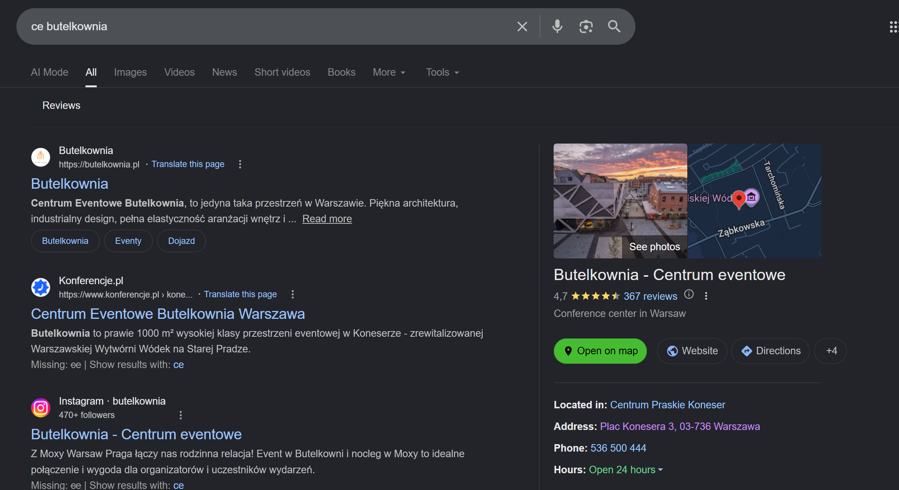
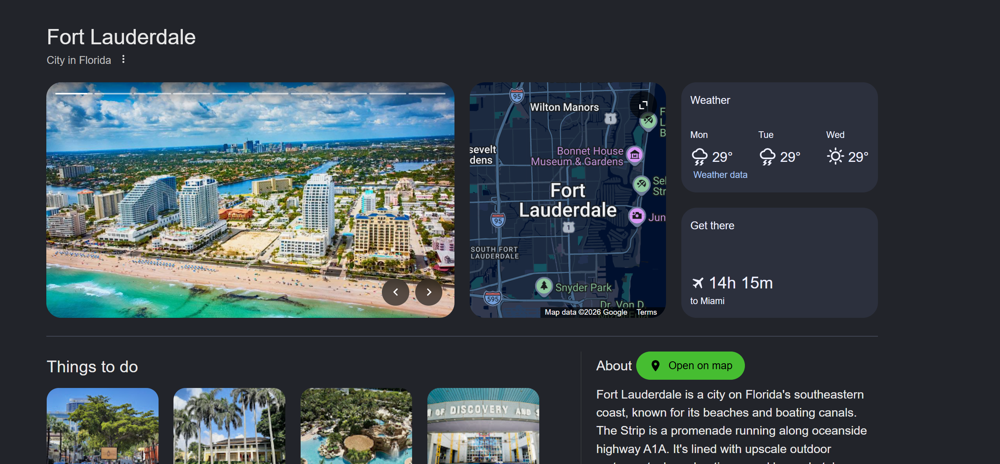
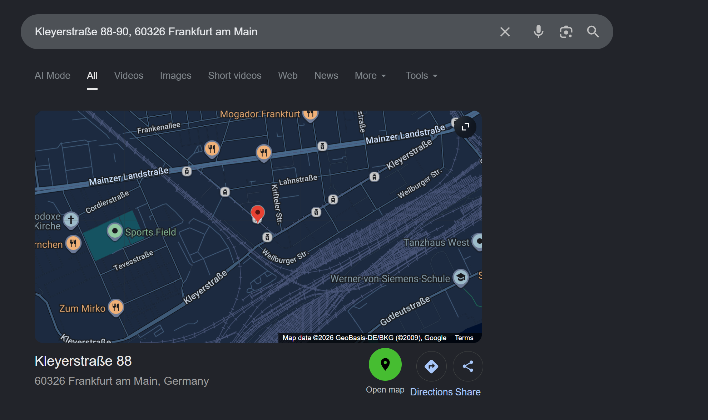

# Open on Map for Google Search

Open on Map for Google Search is a small browser extension that adds an **Open on map** button to Google Search location results.

When Google Search shows a place, address, business, city, or map card, the extension gives you one clear button that opens the same location in Google Maps.



## Why It Exists

Google Search often already shows the exact location you need, but opening that result in Google Maps is not always one click away.

This extension fixes that small daily problem.

## What It Does

- Adds an **Open on map** button to supported Google Search location results.
- Opens Google Maps in a new tab.
- Works with common location layouts such as knowledge panels, address cards, city cards, business results, and mini map cards.
- Runs locally in your browser.

## Privacy

This extension does not collect personal data.

It does not track searches, browsing history, clicks, location history, cookies, or account information. It has no analytics, no ads, no backend, and no remote logging.

Full policy: [PRIVACY_POLICY.md](PRIVACY_POLICY.md)

## Screenshots

### Google Search Place Result


### Google Search City Result



### Google Search Address Result



### Google Maps Result After Opening


## Install

The extension is not yet published in the Chrome Web Store or Firefox Add-ons store.

Until store publishing is complete, install it manually from this repository.

### Chrome

1. Download or clone this repository.
2. Open `chrome://extensions/`.
3. Enable **Developer mode**.
4. Click **Load unpacked**.
5. Select this project folder.
6. Open Google Search and search for a place.

### Firefox

1. Download or clone this repository.
2. Open `about:debugging#/runtime/this-firefox`.
3. Click **Load Temporary Add-on**.
4. Select `manifest.json`.
5. Open Google Search and search for a place.

## Example Searches

Try:

- `Eiffel Tower`
- `Warsaw Central Station`
- `Fort Lauderdale`
- `Zlota 44`
- `restaurants near me`

If Google Search shows a supported location result, the extension should add an **Open on map** button.

## Permissions

The extension runs only on supported Google Search result pages.

It needs access to those pages so it can detect visible location blocks and add the button. It does not use permissions to collect user data.

## Limitations

Google Search changes its page layout over time. If Google changes a location layout, the button may not appear on that specific result until the extension is updated.

## Project

Public repository:

https://github.com/Nomiveb/open-on-map-google-search

Main files:

```text
manifest.json       extension configuration
content.js          location detection and button injection
styles.css          button styling
icons/              extension icons
screenshots/        real product screenshots
PRIVACY_POLICY.md   privacy policy
LICENSE             open-source license
create_icons.py     icon generation helper
```

There is no build system and no runtime dependency. The extension source is readable directly from the repository.

## Development

After changing the code:

1. Reload the extension in the browser.
2. Hard-refresh the Google Search tab.
3. Test several location searches.

To regenerate icons:

```bash
pip install Pillow
python create_icons.py
```

To create a store package:

```powershell
Compress-Archive -Path manifest.json,content.js,styles.css,icons,README.md,PRIVACY_POLICY.md,LICENSE,create_icons.py -DestinationPath open-on-map-google-search-1.0.0-store.zip -Force
```

## License

MIT License. See [LICENSE](LICENSE).
